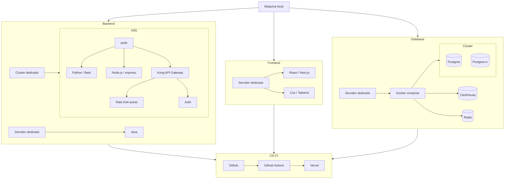

⚠️ Aviso ⚠️

O seguinte codigo é aberto ao público para fins acadêmicos, não possuindo devidas certificações de criptografia e compliance.
O codigo não deve ser utilizado para gerar receita ou fins comerciais.

⚠️ Notice ⚠️

This is a open-source software created for academic and study purposes only. This software is not certified for encryption or security compliance.
This software must not be used for commercial purposes or to generate revenue.

---

# Portugues - BR

# Introdução

O produto foi idealizado mediante um conflito pessoal de seu programador, onde existia a necessitava registrar seu fluxo de gastos diários para entender seu custo de vida e caixa.

O software foi desenvolvido para substituir uma planilha utilizada anteriormente pelo programador localizada no Google drive, que continha abas de gráficos dinâmicos e celulas para inserir valores. A Problematica da planilha são as funções que por muitas vezes podiam gerar erros por estarem fortemente ligadas aos gráficos e a necessidade constante de trocar de planilha a cada ano.

Podemos concluir que a planilha carecia de consistencia de dados e flexibilidade na manutenção.

## O porque das tecnologias?

Antes de verificamos as escolhas de Stack (estrutura e tecnologias de um produto), nos é exigido o entendimento do software para fins acadêmicos e sem investimento prévio, limitando as escolhas de tecnologias do seu desenvolvedor.

As tecnologias escolhidas de programação

* Java
* Python
    flask
* JavaScript
    Node
    React
    Next

### Infraestrutura

As aplicação utiliza cluster de banco de dados e kubernetes, ambos executados em containers Docker em rede interna

As imagens do container serão as da comunidade, como no caso do Redish ou Clickhouse, algumas exceções poderam utilizar imagens padrões como ubuntu, em ambos os casos os S.O constará

* Ubuntu Server
* Debian Bookworm
* CentOS

A aplicações em JAVA é provisionado em maquina windows.

### Front-end

Desenvolvido em React com Next, provisionado em maquina virtual Debian Bookworm.
Como simulação o deploy será provisionado para Vercel, somente como demo

### Back-end

Estrutura composta por

* Monólito em Java (core)
* Dois microserviços
    Python, como serviço de dados
    JavaScript, como serviço de login

Os serviços não devem ter comunicação interna entre eles, o Java não deverá jamais acessar o Python assim como JavaScript não deverá acessar o Python, esse isolamento é parte da arquitetura de microserviços, o unico meio de comunicação entre eles deverá ser as chamadas do front-end para KongAPI e a base de dados postgres, Demais bases de dados como Redis e Clickhouse será provisionado somente para KongAPI e Python respectivamente.

Por possuir dois microserviços e monolito, a arquitetura é híbrida

Para evitar ataques o serviço conta com um rateLimit e autenticação via SSO.

Não é possivel criar usuarios locais fora o admin, que deverá ser excluido com uma chamada de procedure XXXX(x) após testes concluidos.

### Banco de dados

* ClickHouse, banco analítico
* Redish, banco em cache
* Postgres, banco relacional com replica

### Consideraçoes

* Com essa arquitetura é possivel ter problemas pontuais em serviços distintos, priorizando o serviço Core.
* O serviço Core é um POO com padrão CleanCode.
* O KongAPI poderá ser integrado com Grafana/Prometheus

O serviço é local, por isso não é provisionado uma rede adequada, no final do README está uma demonstração mais realista no Google Cloud

### Tabela matrix de comparação

| Categoria     | Python| Java  | JavaScript |
|---------------|-------|-------|-------|
| Facilidade    | X     | X     | X     |
| Velocidade    | x     | X     | X     |
| Desempenho    | X     | X     | X     |
| Escalabilidade| X     | X     | X     |
| Comunidade    | X     | X     | X     |
| Documentação  | X     | X     | X     |
| Segurança     | X     | X     | X     |
| Custo         | X     | X     | X     |

# English - EUA
