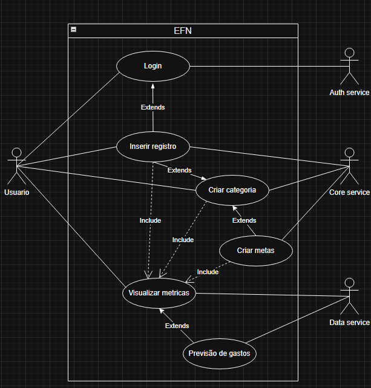
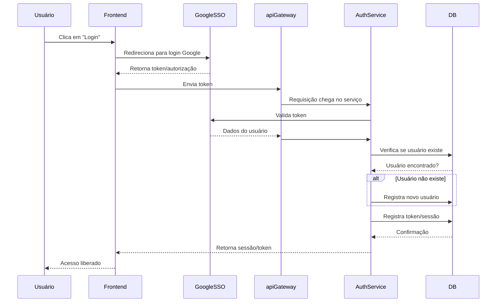
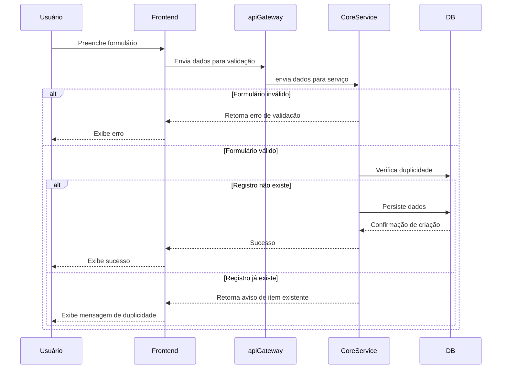
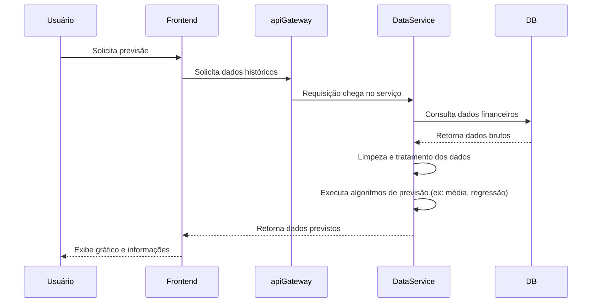
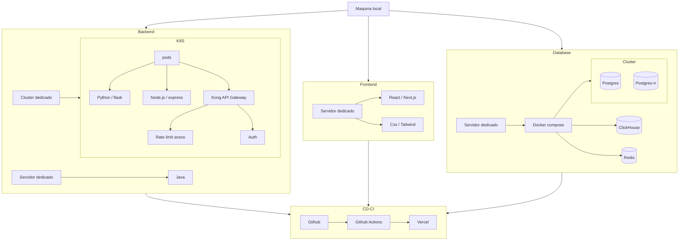

# MVP

## Controle de orçamento

## EFN

## Easy Fin

### Objetivo

Serviço de controle de orçamento pessoal.

### Problemática

O aumento expressivo das casas de aposta (30 bilhões por mês de acordo com Banco Central) e perda contínua do Real frente ao Dólar (2,43 em 2005 para 4,95 em 2024, mais de 100% de desvalorização em 2025), confirmam o fato que a população Brasileira precisa de meios para gestão de orçamento. 

### Público alvo

Famílias de baixa ou média renda com interesse em gestão financeira.

### Solução

Plataforma web PaaS, a plataforma deverá permitir registros de metas, demonstrativo da evolução ao longo do período, armazenar gastos do mês com relação às categorias como Mercado, Jogos, Cuidados pessoais entre outros com intenção de identificar padrões de gastos.

1. Funcionalidades principais
    * Login com e-mail (com suporte a SSO)
    * Login local
    * Registro e histórico de despesas/receitas
    * Criação de categorias/tags personalizadas
    * Previsão de gastos por categoria
    * Gráficos interativos e insights mensais
    * Cadastramento de contas diversas
    * Definição de metas por categoria
    * Filtro por tags/contas/periodo/categoria/metas
2. Funcionalidade opcionais
    * Envio de alertas e relatórios por e-mail (via SMTP)
    * Integração com Open Finance (bancos e instituições financeiras)
    * Conexão com APIs de mercado financeiro e criptos
    * Monitoramento da inflação
    * Conversão e valorização cambial (Real x Dólar)

### Diagramas
Caso de uso



### Diagrama classes

### Diagramas de sequência

#### Login (atualizar)



#### Transacao/grupo/categoria/tag/conta (atualizar)



#### visualizacao (atualizar)



### tema

```mermaid

```

### Diagrama componentes

```mermaid
flowchart TD
 subgraph Frontend["Frontend"]
        next["React"]
  end

 subgraph Backend["Backend"]
    subgraph K8S["K8S"]
      node["Node.js API"]
      python["Python API"]
      kong["API GATEWAY"]
    end

    subgraph VM["VM"]
      java["Java API"]
    end
  end

  subgraph Database["Database"]
    subgraph Cluster["Cluster"]
      dbCore[("Postgres")]
      dbCoreRR[("Postgres-rr")]
    end
    dbData[(ClickHouse)]
    dbMemory[(Redish)]
  end

    Frontend -- HTTP --> kong
    kong-- HTTP --> dbMemory
    kong-- HTTP --> python
    kong-- HTTP --> node
    kong-- HTTP --> java
    Backend -- JDBC --> Database
    python -- HTTP --> dbData
```

### Diagrama de implantação



### Diagrama SGBD

### Diagrama de fluxos

#### Modelo de desing

[https://www.figma.com/proto/Eosrz0eaVq52kG1z3gFocA/Web-Desing?node-id=0-1&t=tQiGimJXFbU63Mxo-1](https://www.figma.com/proto/Eosrz0eaVq52kG1z3gFocA/Web-Desing?node-id=0-1&t=tQiGimJXFbU63Mxo-1)

### Concorrentes

* [Kinvo](https://kinvo.com.br/)
* [Minhas Economias](https://minhaseconomias.com.br/)
* [Meu Dinheiro - Sistema para controle financeiro pessoal e empresarial](https://www.meudinheiroweb.com.br/)
* [Organizze: Controle Financeiro Pessoal - Organizador de contas](https://www.organizze.com.br/#recursos)
* [Wisecash Web](https://www.wisecashapp.com.br/#/site)

### Fontes

[Gasto com apostas online chegam a 30 bilhoes| infomoney](https://www.infomoney.com.br/politica/gastos-com-apostas-online-chegam-a-r-30-bilhoes-por-mes-e-acendem-alerta-no-bc/)

[Crise reduz poder de compra e muda perfil de consumo da classe média | Economia | G1](https://g1.globo.com/economia/noticia/2021/04/24/crise-reduz-poder-de-compra-e-muda-perfil-de-consumo-da-classe-media.ghtml)
